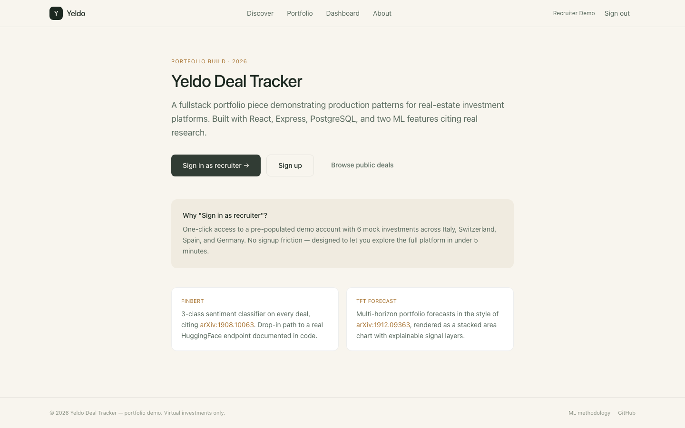
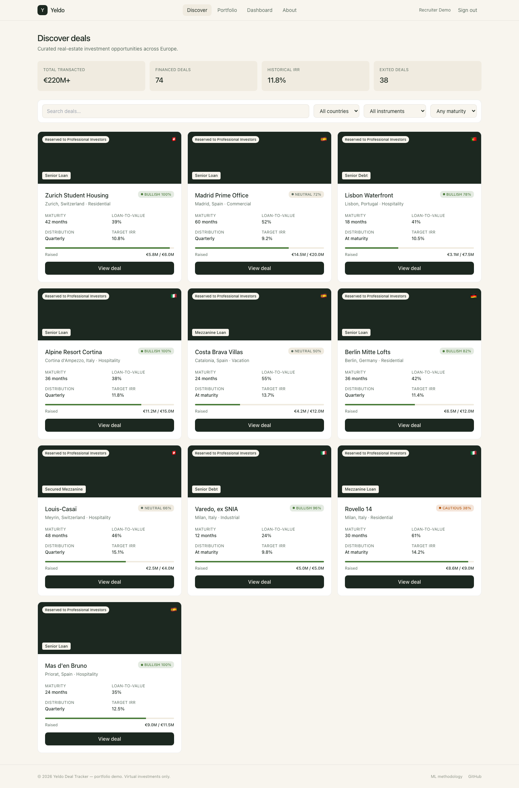
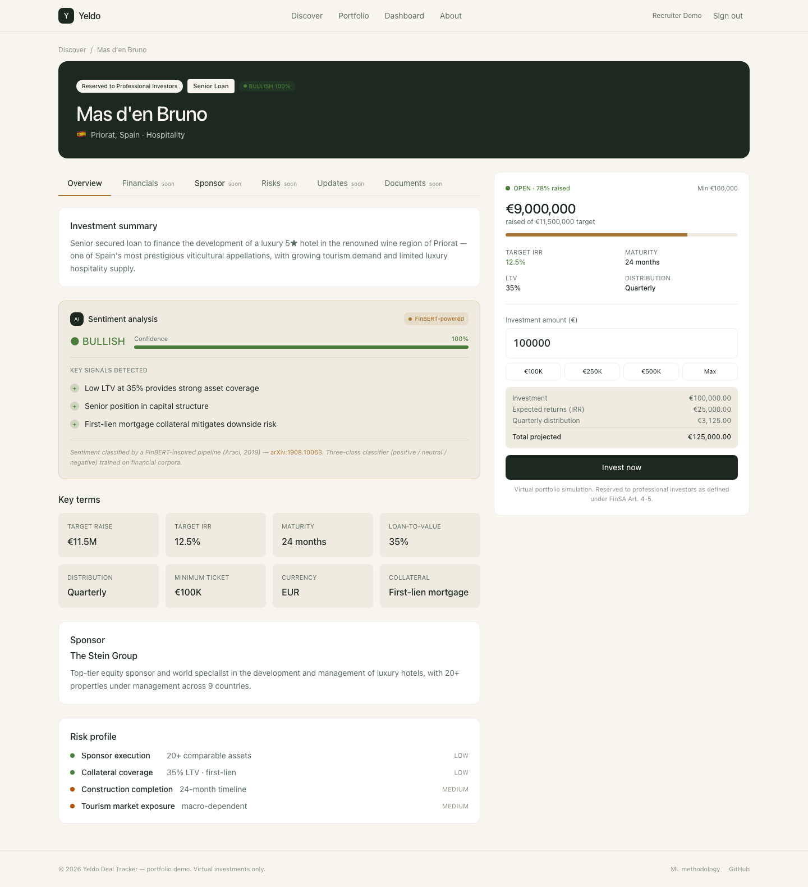
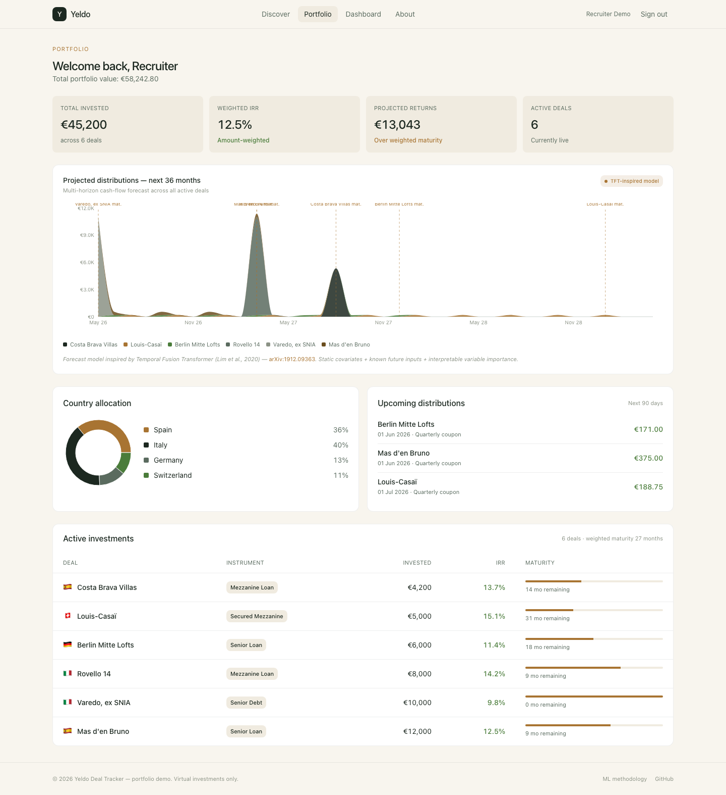
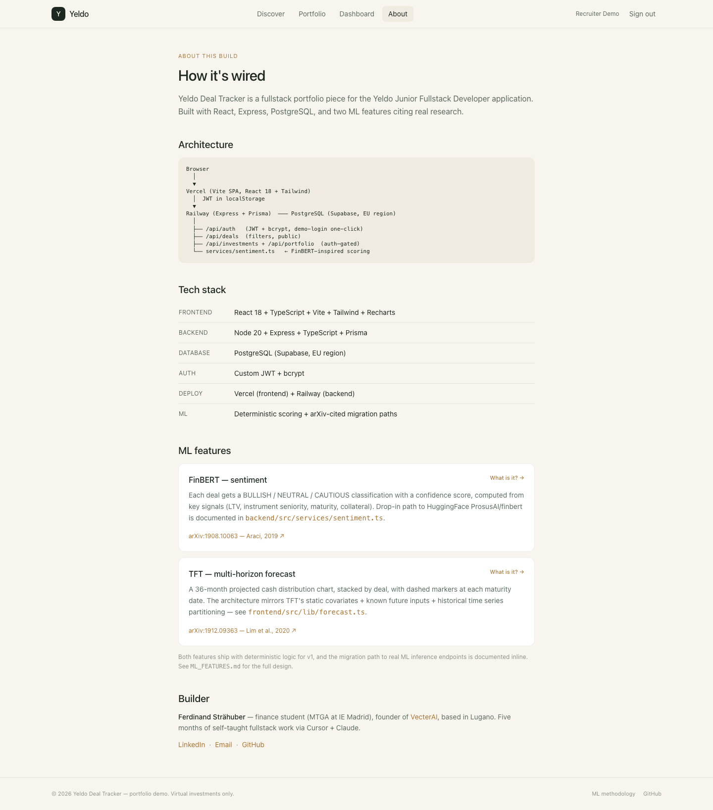

# Yeldo Deal Tracker

A fullstack real-estate investment platform demonstrating production patterns for fintech UIs, built with React, Node.js Express, PostgreSQL, and two ML-powered features citing real research papers.

**Built by [Ferdinand Straehuber](https://linkedin.com/in/ferdinand-straehuber)** — finance student moving into fullstack development. Portfolio piece for the [Yeldo Junior Fullstack Developer](https://www.yeldo.com/careers) application.

---

## 🎯 For Yeldo recruiters — start here

**Live demo:** [yeldo-deal-tracker.vercel.app](https://yeldo-deal-tracker.vercel.app)
**Repo:** [github.com/Rapixx19/Yeldo-Dimostration](https://github.com/Rapixx19/Yeldo-Dimostration)
**One-click access:** click *"Sign in as recruiter"* on the landing page — no signup needed, pre-populated with 6 mock investments

**5-minute walkthrough:** see [`RECRUITER_GUIDE.md`](./RECRUITER_GUIDE.md)
**ML features deep-dive:** see [`ML_FEATURES.md`](./ML_FEATURES.md)
**Every interactive element documented:** see [`INTERACTIONS.md`](./INTERACTIONS.md)
**Build plan:** see [`EXECUTION_PLAN.md`](./EXECUTION_PLAN.md) — git workflow, module contracts, verification gates

## 📸 Screenshots

| Landing | Discover |
|---|---|
|  |  |

| Deal detail (with FinBERT widget) | Portfolio (with TFT forecast) |
|---|---|
|  |  |

| About — ML methodology |
|---|
|  |

### What you can actually do in the live demo

| Step | What to try | What it demonstrates |
|---|---|---|
| 1 | Click *"Sign in as recruiter"* | One-click demo onboarding, JWT auth |
| 2 | Browse `/discover` | Filter chips, search input, responsive card grid |
| 3 | Click into *Mas d'en Bruno* | Tabbed deal detail, sticky invest sidebar |
| 4 | Hover the *"FinBERT-powered"* badge | Modal explains the ML feature + arXiv link |
| 5 | Enter amount and click *Invest now* | Virtual investment, REST POST, toast confirmation |
| 6 | Navigate to `/portfolio` | KPI cards, 36-month TFT forecast chart |
| 7 | Hover *"TFT-inspired model"* badge | Modal explains TFT + arXiv link |
| 8 | Click `/about` in footer | Architecture, tech stack rationale |

---

## 🛠 Tech stack — aligned to the Yeldo JD

The JD lists *"React, Node.js Express/Koa/Hapi alternatives, OOP, Git/Gitflow."* This build uses the Express path.

### Frontend (`/frontend`)
- **React 18** via Vite + React Router
- **TypeScript** (strict mode)
- **Tailwind CSS** (modern SASS equivalent)
- **Recharts** for charts
- **Axios** for HTTP
- **React Hook Form + Zod** for forms
- **Vercel** deployment

### Backend (`/backend`)
- **Node.js 20** + **Express** (explicitly named in JD)
- **TypeScript** (strict mode)
- **Prisma ORM** with **PostgreSQL** (via Supabase)
- **JWT + bcrypt** for auth (custom, not Supabase Auth)
- **Zod** validation (shared schemas with frontend)
- **Railway** deployment

See [`ARCHITECTURE.md`](./ARCHITECTURE.md) for the separated FE/BE topology and rationale.

---

## 🤖 ML features

Two ML-inspired features, each citing a real, high-cited research paper:

### FinBERT — sentiment analysis on deal descriptions
[Araci, 2019 — arXiv:1908.10063](https://arxiv.org/abs/1908.10063) (953 ⭐)
Visible as a chip on each deal card and a widget on the deal detail page. Classifies deals as BULLISH / NEUTRAL / CAUTIOUS with confidence score and key signal explanations.

### TFT — multi-horizon distribution forecast
[Lim et al., 2020 — arXiv:1912.09363](https://arxiv.org/abs/1912.09363) (2,555 ⭐)
36-month stacked area chart on the portfolio dashboard showing projected cash distributions across all active deals.

See [`ML_FEATURES.md`](./ML_FEATURES.md) for the full architecture, code annotations, and production migration path.

---

## 🎨 Brand & design — Editorial Forest + Brass

Deliberately distinct from Yeldo's cleaner neutral palette — designed to feel **European luxury wealth platform**, distinct from generic SaaS slate/zinc:

- `--bg-page #F8F5EE` (warm cream)
- `--brand-dark #1C2820` (deep forest)
- `--brand-accent #A87432` (antique brass)
- `--text-success #4A7C3A` (sage)

See [`BRAND_TOKENS.md`](./BRAND_TOKENS.md) for the full CSS variable system.

---

## 🚀 Run locally

```bash
# Backend
cd backend
cp .env.example .env       # fill in DATABASE_URL and JWT_SECRET
npm install
npx prisma migrate dev
npm run seed
npm run dev                # → http://localhost:4000

# Frontend (new terminal)
cd ../frontend
cp .env.example .env.local # set VITE_API_URL=http://localhost:4000
npm install
npm run dev                # → http://localhost:5173
```

After seeding, log in as:
- **Email:** `ferdinand.straehuber@gmail.com`
- **Password:** `demo123`

---

## 📂 Repository structure

| Folder | Contains |
|---|---|
| [`/docs`](./docs) | 15 Cursor-ready spec files (one per feature) |
| [`/frontend`](./frontend) | React + Vite app |
| [`/backend`](./backend) | Express + Prisma API |
| [`/mockups`](./mockups) | Reference HTML mockups (open any in a browser) |

### Spec files (drop each into Cursor in order)
- `00-project-setup` — both repos scaffolded
- `01-database-schema` — Prisma schema + migrations
- `02-backend-auth` — JWT + bcrypt
- `03-backend-deals-api` — REST endpoints
- `04-backend-investments-api` — investments + portfolio
- `05-frontend-setup-with-tokens` — Vite + Tailwind + brand
- `06-frontend-auth` — login, signup, demo-login
- `07-frontend-deals-list` — Discover page
- `08-frontend-deal-detail` — deal detail with tabs
- `09-frontend-portfolio` — portfolio page
- `10-frontend-dashboard` — dashboard with charts
- `11-seed-data` — 10 realistic mock deals
- `12-finbert-sentiment` — FinBERT widget
- `13-tft-forecast` — TFT-inspired forecast chart
- `14-deployment` — Vercel + Railway deploy

See [`BUILD_ORDER.md`](./BUILD_ORDER.md) for the recommended sequence.

---

## License

MIT — fork freely.

**Repo author:** [Ferdinand Straehuber](https://linkedin.com/in/ferdinand-straehuber) · Lugano, Switzerland · [vecterai.tech](https://vecterai.tech)
